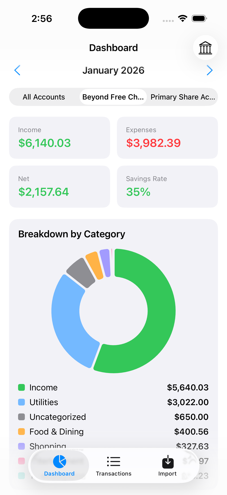
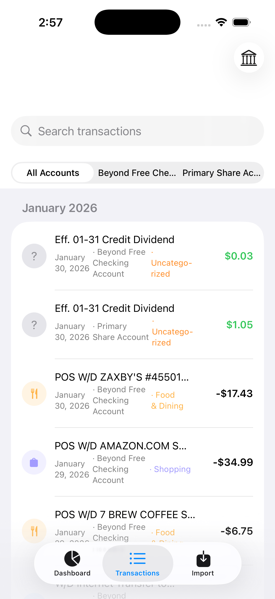
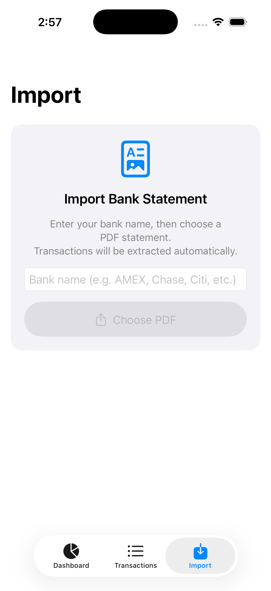

# BudgetCalc

A native iOS app that lets you import bank statement PDFs and get a clear picture of where your money goes.

---

## Screenshots

<p float="left">
  
  
  
</p>

---

## Features

- **PDF Import** — Import bank statements from any bank (ECU, AMEX, Chase, etc.)
- **Multi-account support** — Statements with multiple accounts (e.g. Savings + Checking) are detected automatically; pick which accounts to import
- **Auto-categorization** — Transactions are automatically tagged on import (Food & Dining, Shopping, Housing, Utilities, etc.) and can be manually overridden at any time
- **Breakdown by Category** — Visual chart showing spending and income split by category for any month
- **Income vs. Expenses** — Summary cards showing total income, total expenses, and savings rate
- **Monthly navigation** — Browse any past month with a simple picker

---

## Requirements

- iOS 17+
- Xcode 15+
- Swift 5.9+

---

## Getting Started

1. Clone the repo
   ```bash
   git clone https://github.com/your-username/budget-calc-app-ios.git
   cd budget-calc-app-ios
   ```

2. Open in Xcode
   ```bash
   open BudgetCalc.xcodeproj
   ```

3. Select a simulator or your device from the toolbar and press **Cmd+R**

> No API keys or external dependencies required — everything runs on-device.

---

## Running on a Personal Device

1. In Xcode go to **BudgetCalc target → Signing & Capabilities**
2. Check **Automatically manage signing** and select your Apple ID as the Team
3. Connect your iPhone, select it from the device dropdown, and press **Cmd+R**
4. First launch: go to **Settings → General → VPN & Device Management** and trust your developer certificate

> Free Apple ID accounts work fine for personal use (app reinstall required every 7 days).

---

## How PDF Parsing Works

The app uses **PDFKit** to extract raw text from bank statement PDFs and then parses it with a custom rule-based engine:

- Supports both `MM/DD` and `MM-DD` date formats
- Handles multi-account statements by detecting section headers (e.g. *Primary Share Account*, *Beyond Free Checking Account*)
- For statements where each transaction line includes a running balance, the parser correctly picks the transaction amount (second-to-last value) rather than the balance (last value)
- Multi-line merchant descriptions are joined automatically

**Tested with:** Eastman Credit Union (ECU)

> Other banks should work as long as the PDF is text-based (not a scanned image). If a bank isn't parsing correctly, open an issue with a redacted sample.

---

## Auto-Categorization Rules

On import, transactions are matched against keyword rules and assigned a category automatically:

| Category | Example matches |
|---|---|
| Income | PAYROLL, DIRECT DEP, VENMO - CASHOUT |
| Housing | RENT, MORTGAGE, FOGELMAN |
| Food & Dining | CHICK-FIL-A, CHIPOTLE, WALMART SUPERCENTER, DOORDASH |
| Transportation | UBER, PARKWHIZ, SHELL, EXXON |
| Shopping | AMAZON, TARGET, T.J. MAXX, HOBBY LOBBY |
| Entertainment | NETFLIX, SPOTIFY, NASHVILLE MLS, APPLE.COM/BILL |
| Health | CVS, WALGREENS, URGENT CARE, PLANET FITNESS |
| Utilities | NES ELECTRIC, AT&T, COMCAST, VERIZON |

Unmatched transactions are left as *Uncategorized* and can be tagged manually by tapping any transaction.

---

## Data Storage

All data is stored **on-device** using SwiftData. Nothing is sent to any server.

---

## Project Structure

```
BudgetCalc/
├── Models/
│   ├── Transaction.swift           # SwiftData model for a single transaction
│   └── Category.swift              # SwiftData model + default category seeds
├── Services/
│   ├── PDFParser.swift             # PDF text extraction + transaction parsing
│   └── AutoCategorizer.swift       # Keyword-based auto-categorization engine
├── Views/
│   ├── DashboardView.swift         # Summary cards + breakdown by category chart
│   ├── TransactionsListView.swift  # Full transaction list with category picker
│   ├── ImportView.swift            # PDF import flow + account selection
│   └── CategoryPickerView.swift    # Sheet for manually tagging a transaction
└── ContentView.swift               # Tab bar root

Screenshots/
├── budgetcalc_dashboard.png
├── budgetcalc_transactions.png
└── budgetcalc_import.png

Scripts/
└── generate_fake_statement.py      # Generates a fake ECU-style PDF for testing
```
